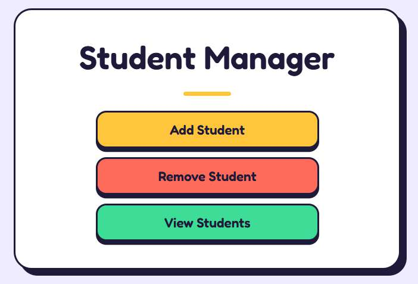
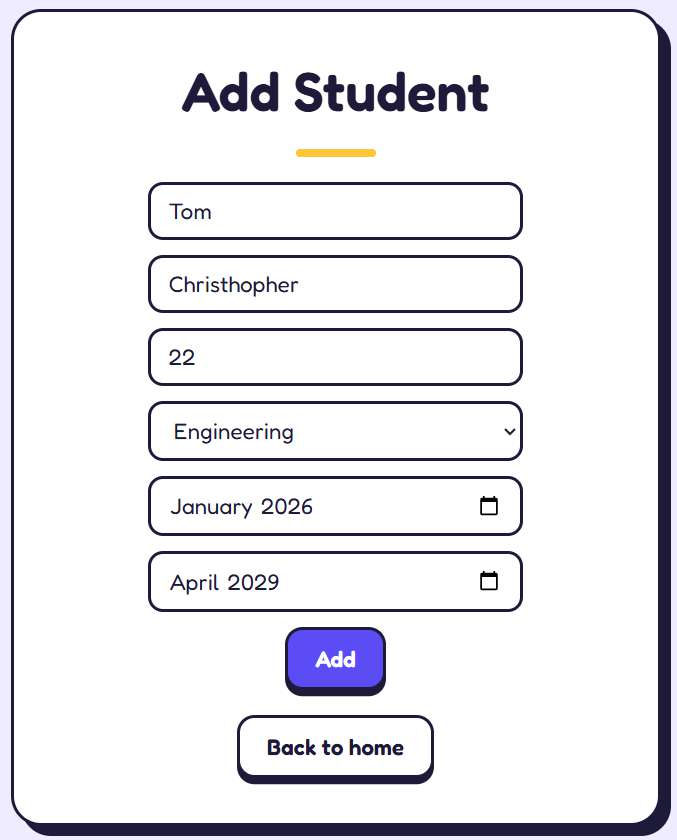
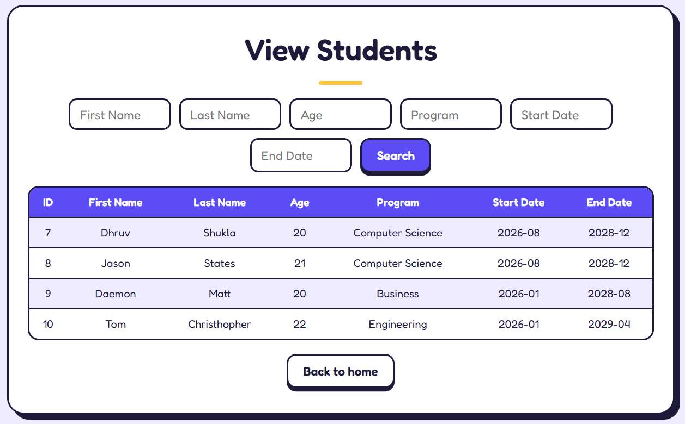

# 🎓 Student Management

A full-stack student management web application built with Flask, SQLite, HTML, CSS, and JavaScript.

<p align="center">
  <a href="https://student-management-mauve-six.vercel.app">
    
  </a>
  <a href="https://github.com/shukladhruve777-blip/Student_Management">
    
  </a>
</p>

> **Try it in your browser:** [student-management-mauve-six.vercel.app](https://student-management-mauve-six.vercel.app)

---

## ✨ Project Overview

Student Management is a full-stack CRUD-style application for managing student records.

The project combines a Flask backend, SQLite database, HTML/CSS templates, and JavaScript-driven interactions to provide a simple workflow for adding, removing, viewing, and searching student information.

## 🎯 Key Features

- ➕ Add student records
- 🗑️ Remove student records
- 📋 View stored students
- 🔎 Search by individual fields
- 💾 SQLite database storage
- ⚡ Dynamic table loading with JavaScript
- 🔗 Flask routes for backend operations
- 📱 Responsive interface

## 🛠️ Tech Stack

| Technology | Purpose |
|---|---|
| **Python** | Backend programming |
| **Flask** | Web framework and routing |
| **SQLite** | Local relational database |
| **HTML5** | Page structure |
| **CSS3** | Styling and layout |
| **JavaScript** | Dynamic UI, searching and table updates |

## 🖥️ Screenshots

### Student Management Dashboard



### Add Student



### View Students



## 🔄 How It Works

```text
Browser
   │
   ▼
HTML / CSS / JavaScript
   │
   ▼
Flask Backend
   │
   ▼
SQLite Database
```

## 🧠 What I Practiced

This project gave me hands-on experience with:

- Flask routing
- SQLite database operations
- CRUD-style functionality
- HTML forms
- JavaScript DOM manipulation
- Fetch API
- Dynamic table rendering
- Client-side filtering
- Separating frontend and backend responsibilities
- Connecting a web interface to persistent data

## 📁 Project Structure

```text
Student_Management/
├── app.py
├── students.db
├── requirements.txt
├── templates/
│   ├── index.html
│   ├── add.html
│   ├── remove.html
│   └── view.html
└── static/
    ├── style.css
    └── script.js
```

## 🚀 Run Locally

```bash
git clone https://github.com/shukladhruve777-blip/Student_Management.git
cd Student_Management
pip install -r requirements.txt
python app.py
```

Then open:

```text
http://localhost:5000
```

## 📌 Project Status

The application provides the core student-record management workflow with a Flask backend, SQLite persistence, and a JavaScript-enhanced interface.

---

### 🔗 Links

**Live Demo:** https://student-management-mauve-six.vercel.app  
**GitHub Repository:** https://github.com/shukladhruve777-blip/Student_Management

**Built with Python • Flask • SQLite • HTML • CSS • JavaScript**
